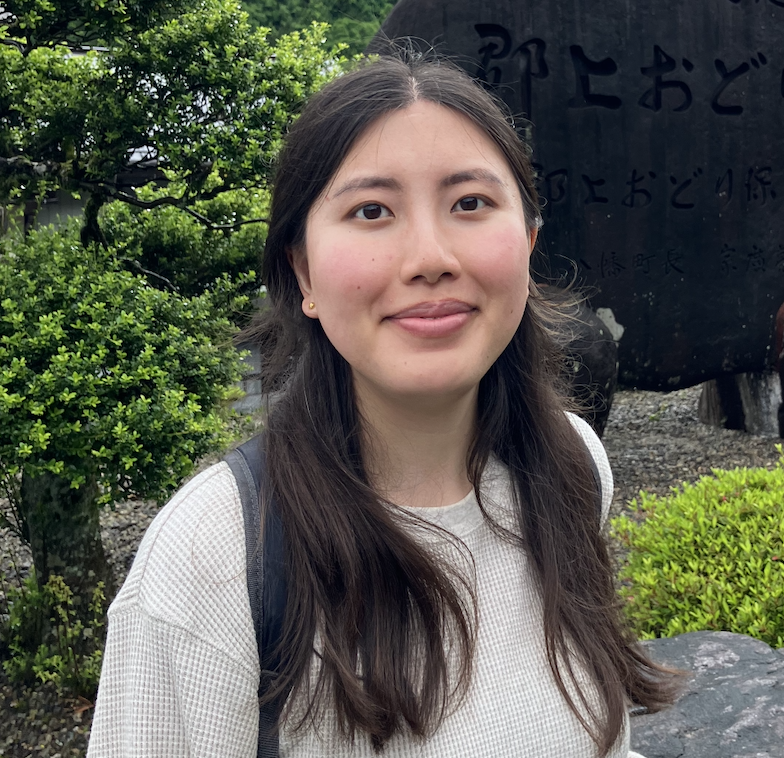

## About Me

Hi! My name is Lin (she/her). I am a PhD student at the [Max Planck Institute for Security and Privacy (MPI-SP)](https://www.mpi-sp.org/) where I am supervised by [Asia Biega](https://asiabiega.github.io/) in the Responsible Computing Group. 

I am supported by the 2025 [Google PhD Fellowship](https://research.google/programs-and-events/phd-fellowship/) (in the Privacy, Safety, and Security research area). My papers have received the 2024 [Council of Europe Award in Data Protection](https://www.coe.int/en/web/data-protection/2024-rodot%C3%A0-award) and a Best Paper Award at the 2025 [Annual Privacy Forum](https://privacyforum.eu/).  My research has also engaged regulators, industry, trade unions, privacy NGOs, and AI ethics stakeholders across North America and Europe.   

The goal of my research is to advance digital rights, centred on consent as a foundation for building ethical technologies and giving users data autonomy. I am working to reimagine online consent, thinking of how to move beyond consent notices to consent that truly gives users data agency, and can be applied broadly to different data governance scenarios. My work sits at the intersection of **security and privacy**, **human-computer interaction**, and **tech policy**. I use qualitative and quantitative HCI research methods, and primarily publish at top-tier computing venues (CHI, USENIX Security) and venues for regulators and policymakers. 

## Education

**PhD in Computer Science at the Max Planck Institute for Security and Privacy (MPI-SP)** (Bochum, Germany)  
Supervisor: Asia Biega    
September 2021 - Present  

**MA in Human-Computer Interaction at Carleton University** (Ottawa, Ontario, Canada)  
Thesis: “End User Mental Models of Social Engineering Attacks” [PDF](https://curve.carleton.ca/system/files/etd/2b0397df-0447-481a-bedb-3cdfed153cd3/etd_pdf/20586d0098ccea7701d7ce1fe928acd5/kyi-endusermentalmodelsofsocialengineeringattacks.pdf)  
2019 - 2021  

**BA (Honours) in Psychology at Queen’s University** (Kingston, Ontario, Canada)  
2015 - 2019  

## Relevant Work Experience

**Visiting Researcher at University of Oxford** (Oxford, UK)  
Hosted by the Human-Centred Computing Group, Department of Computer Science  
September - December 2023  

**Pool of Experts, European Data Protection Board** (Remote)   
2023 - 2024 

**User Experience Research Intern at the Government of Canada** (Ottawa, ON)  
May - August 2020
