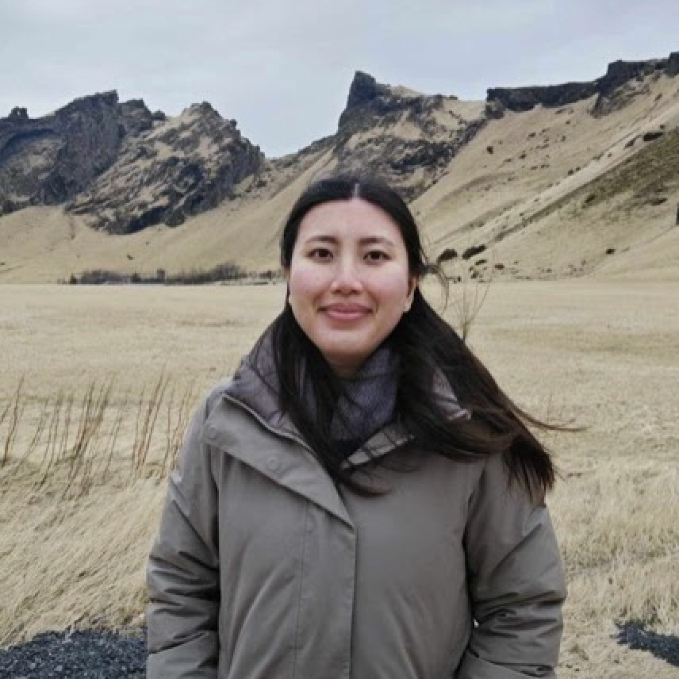

## About Me

Hi! My name is Lin (she/her). I am a PhD student at the [Max Planck Institute for Security and Privacy (MPI-SP)](https://www.mpi-sp.org/) where I am supervised by [Asia Biega](https://asiabiega.github.io/) in the Responsible Computing Group. I am supported by the 2025 [Google PhD Fellowship](https://research.google/programs-and-events/phd-fellowship/) (in the Privacy, Safety, and Security research area). My papers have received the 2024 [Council of Europe Award in Data Protection](https://www.coe.int/en/web/data-protection/2024-rodot%C3%A0-award) and a Best Paper Award at the 2025 [Annual Privacy Forum](https://privacyforum.eu/).

The goal of my research is to advance responsible data collection practices, centred on consent as a foundation for building ethical technologies. My work sits at the intersection of **security and privacy**, **human-computer interaction**, and **tech policy**. I use qualitative and quantitative HCI research methods, and primarily publish at top-tier computing venues (CHI x3, USENIX Security) and venues for regulators and policymakers. My research makes the following contributions:  
1. **Advance understanding of GDPR consent mechanisms beyond the user interface**: examining legal loopholes to consent, and requirements for meaningful and informed consent;  
2. **Mitigate emerging challenges to consent**: informing responsible data collection practices for GenAI development, and the limits of consent in giving workers agency over their data; and  
3. **Propose a collective data governance framework for consent** based on insights from 1 and 2, giving people more leverage over their data in a variety of data governance contexts    

My research has engaged regulators, industry, trade union, privacy NGOs, and AI ethics stakeholders across Europe and North America by challenging conventional notions of consent and responsible data collection, and showing that it must extend beyond security + privacy and data protection law. I have presented and discussed my work with: the [Future of Privacy Forum](https://fpf.org/), [French Data Protection Authority (CNIL)](https://www.cnil.fr/en/), [UC Berkeley Center for Long-Term Cybersecurity](https://cltc.berkeley.edu/), the [European Trade Union Institute (ETUI)](https://www.etui.org/), the [Montreal AI Ethics Institute](https://montrealethics.ai/), the [JP Morgan AI Research Group](https://www.jpmorganchase.com/about/technology/research/ai), and [NOYB](https://noyb.eu/en).   

**I am on the job market this academic year for tenure-track faculty and post doc positions in information and computer science. If you think I might be a good fit for an opportunity in your department or network, please reach out!**

## Education

**PhD in Computer Science at the Max Planck Institute for Security and Privacy (MPI-SP)** (Bochum, Germany)  
Supervisor: Asia Biega  
Thesis topic: Reimagining Online Consent for Responsible, Human-Centric and Sustainable Data Collection  
September 2021 - Present  

**Visiting Researcher at University of Oxford** (Oxford, UK)  
Hosted by the Human-Centred Computing Group, Department of Computer Science  
September - December 2023  

**MA in Human-Computer Interaction at Carleton University** (Ottawa, Ontario, Canada)  
Thesis: “End User Mental Models of Social Engineering Attacks” [PDF](https://curve.carleton.ca/system/files/etd/2b0397df-0447-481a-bedb-3cdfed153cd3/etd_pdf/20586d0098ccea7701d7ce1fe928acd5/kyi-endusermentalmodelsofsocialengineeringattacks.pdf)  
2019 - 2021  

**BA (Honours) in Psychology at Queen’s University** (Kingston, Ontario, Canada)  
2015 - 2019  
